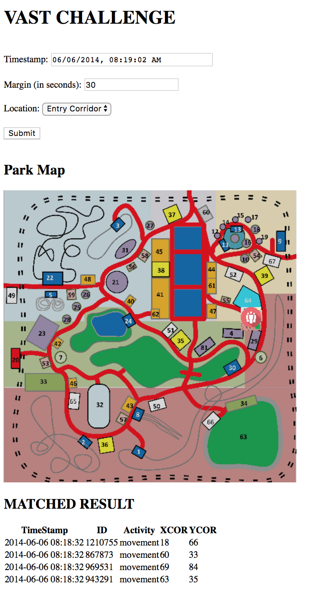

# LAS_VASTDB

This project is based on 2015 VAST Challenge http://vacommunity.org/VAST+Challenge+2015. Our goal is mapping temporal and multifacets data together and try to find patterns of user behaviors.

## Steps to run it on your laptop
- add database.php file in current folder
- run 'php -S localhost:8000' on your command line
- open localhost:8000/message_identify.html on your browser
- play with the Demo!

